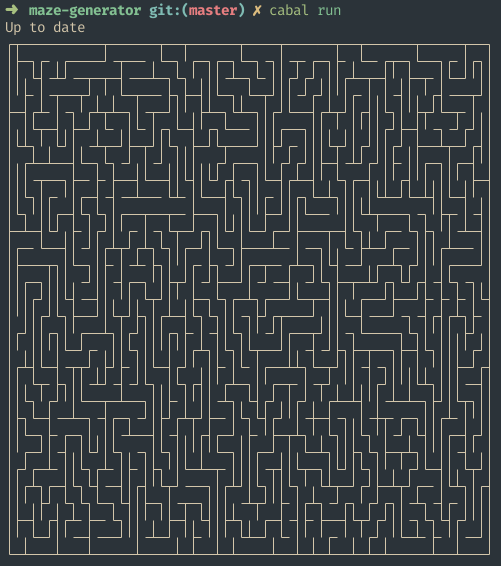

# Maze-generator

Simple tool for generating mazes, written in Haskell. Here's example of it's
output:


## Usage
Use `cabal` build tool for managing this project. Following command will
install all dependencies, compile and run project. More information can
be found inside [maze-generator.cabal](./maze-generator.cabal) file.
```bash
$ cabal run
```
You can configure width and height of maze in [Main.hs](app/Main.hs) file. 
Unfortunately no other ways exist for configuration of behaviour of program.
As for now, I'm not planning on implementing any.

## Tools
This project was written in Haskell 8.10.2 using
* [Cabal](https://www.haskell.org/cabal/) - build tool
* [stylish-haskell](https://github.com/haskell/stylish-haskell) - code prettifier
